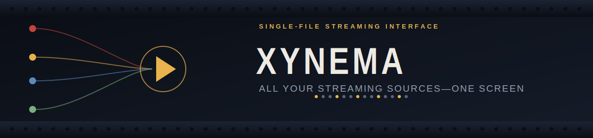

<div align="center">



<br>


</div>

<hr>

## Overview

Xynema is a lightweight, front-end-only streaming interface that combines multiple streaming servers into a single HTML page. Instead of jumping between separate sites, it gives you one place to search for a title, pick a source, and start playback — no build step, no backend, no accounts.

It started as an experiment in unifying several content sources behind one simple UI, and stayed a single file on purpose.

<hr>

## Features

| | |
|---|---|
| 🎞️ **Single HTML file** | The entire app lives in one `index.html` — open it and it runs |
| 🔀 **Multi-server integration** | Combines several streaming servers behind one interface |
| ⚡ **Lightweight & fast** | No frameworks, no build tools, no bundling |
| 🧩 **Zero setup** | Clone it, open it, done |
| 🎛️ **Easy to customize** | Servers, styling, and listings all live in plain, editable markup |

<hr>

## How It Works

Xynema acts as a unified streaming shell. Rather than opening several streaming sites individually, you browse from one page and pick whichever available server plays back the title you selected.

```
 ┌───────────┐   ┌───────────┐   ┌───────────┐
 │  Server A │   │  Server B │   │  Server C │
 └─────┬─────┘   └─────┬─────┘   └─────┬─────┘
       │               │               │
       └───────────────┼───────────────┘
                        ▼
                 ┌──────────────┐
                 │    Xynema    │   one search box,
                 │ (index.html) │   one player, one page
                 └──────────────┘
```

<hr>

## Project Structure

```
Xynema/
└── index.html    # Main application file
```

<hr>

## Usage

**1. Clone the repository**

```bash
git clone https://github.com/YehenSilva/Xynema.git
```

**2. Open it**

```bash
cd Xynema
open index.html   # or just double-click the file
```

**3. Watch**

Search for a title, then pick whichever server is currently available for playback.

No install, no dependencies, no backend server required.

<hr>

## Tech Stack

<div align="center">


</div>

<hr>

## Customization

Everything is editable directly inside `index.html`:

- **Streaming server links** — swap in the sources you want to aggregate
- **Styling** — colors, layout, and typography
- **Movie listings** — the catalog shown to the user
- **UI elements** — search, player controls, layout structure

<hr>

## Purpose

Xynema is a front-end experiment in aggregating multiple content sources behind a single, minimal interface — built to explore how far a no-backend, no-framework approach can go.

> **Note:** Xynema doesn't host any content itself. It's a front-end shell that links out to third-party sources, intended for personal and educational use.

<hr>

## Author

**Yehen Silva**

[](https://github.com/YehenSilva)
[](https://yehensilva.vercel.app/)
